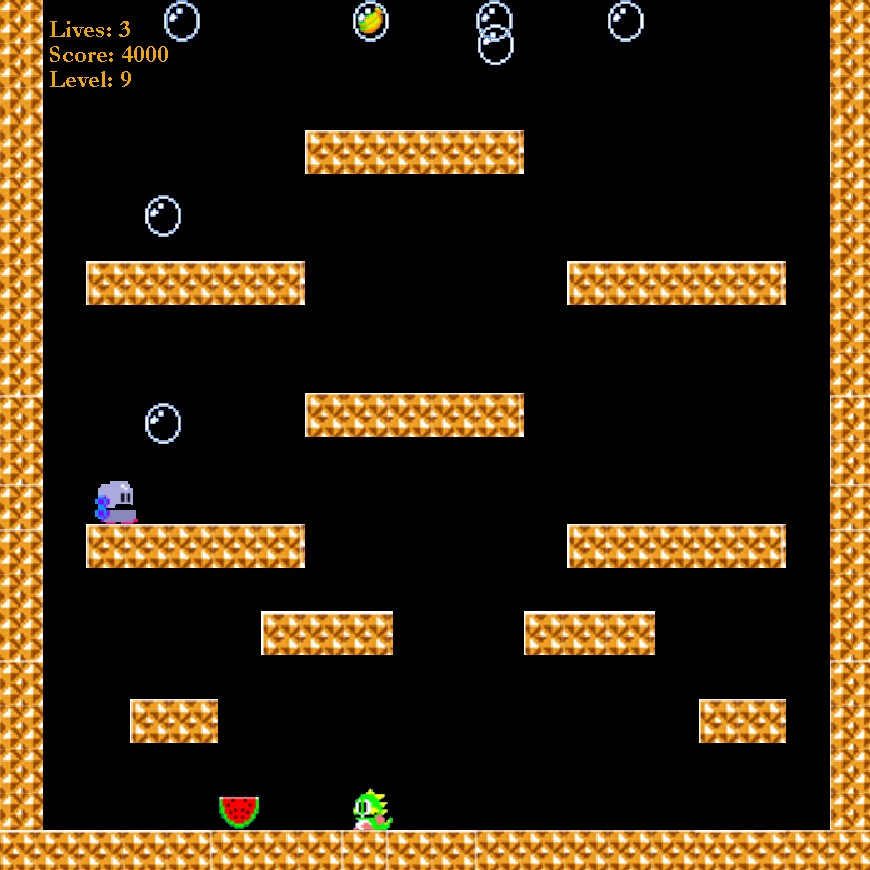

# BubbleBobble
## Info
Contributors: Joshua Eckels, Sabri Amer

Project: Java application development, Bubble Bobble arcade game simulation.

Class: CSSE220 - Introduction to Object-Oriented Programming

Version: Java SE 17

Rose-Hulman Institute of Technology



## Installation
1. Install the [Java SE 17](https://www.oracle.com/java/technologies/javase/jdk17-archive-downloads.html) development kit.
1. `git clone https://github.com/eckelsjd/BubbleBobble`

From the project root `BubbleBobble/`:
```shell
mkdir -p bin
javac -d bin -sourcepath src src/com/bubble_bobble/Main.java
cp -r resources/* bin/
```

And to run:
```shell
cd bin
java com.bubble_bobble.Main
```

## Bundle to `.jar`
From the root `BubbleBobble/` directory:
```shell
mdkir -p bin
javac -d bin -sourcepath src src/com/bubble_bobble/Main.java
cp -r resources/* bin/
jar --create --file BubbleBobble.jar --main-class com.bubble_bobble.Main -C bin/ .
```

And then to run the jar:
```shell
java -jar BubbleBobble.jar
```

We also provide a pre-compiled [jar executable](BubbleBobble.jar).
